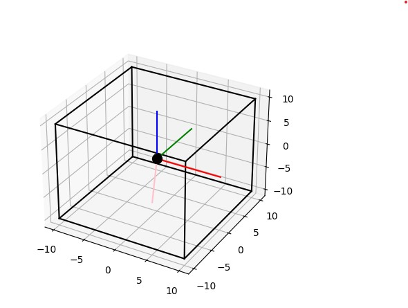
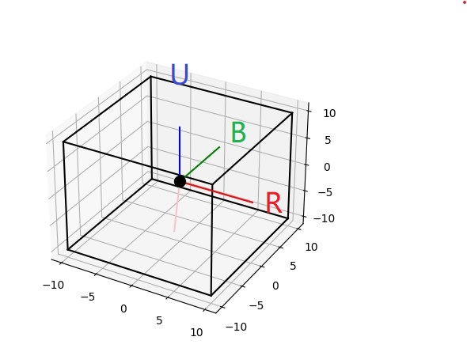

# Using Smart Cube to play Genshin Impact with Python



## Introduction

This (Toy) project is a demostration of using Smart (barely GAN-only now) Cube to play Genshin Impact with Python.


with BLE-enable computer, you can use this project to receive turning and gyroscope(quaternion actually) info from Smart Cube. With these info, you can mapping turning and rotating to keyboard and mouse press, click or move, which make it able to control your character in Genshin Impact. 


The whole project is based on asyncio. The main loop barely do NOTHING but SLEEP :), which is like this:
```python
asyncio.create_task(ask_battery())
asyncio.create_task(plt_plot())
asyncio.create_task(keyboard_handler())

gyro_en = await gyro_en_queue.get()
# only support gyro to mouse map
if gyro_en:
    print("gyro air mouse enable")
    asyncio.create_task(mouse_handler())

# JUST SLEEP
while True:
    await asyncio.sleep(1)

```

video demostration avilable at: [bilibili](https://www.bilibili.com/video/BV1Ku4y1f7rh), [youtube](https://www.youtube.com/watch?v=9CwsR6d1ggQ)

## Requirements

- Windows 10
- Python 3.x
- bleak 
- numpy 
- matplotlib
- pynput
- PyDirectInput
- PyAutoGUI

**Only** tested on Windows 10, due to the mouse's DirectInput mode, I'm not sure if it works on other OS like Linux/MacOS.

The `bleak` is used to make computer as a GATT client, which can connect to GATT server and notify the characteristic value of Smart Cube.

The `numpy` and `matplotlib` are used to do the math and plot the quaternion data from Smart Cube.

The mouse input mode will be changed from `RawInput` to `DirectInput` in some Games like Genshin Impact, so `PyDirectInput` and `PyAutoGUI` are both required. However, the main mouse simulation is using `pynput`. 


## Usage

0. Install all the requirements.

1. Check your computer's bluetooth is on, and make sure your computer is BLE-enable.

2. Hold your cube in White fac up and Green face front, then turn on your cube by `U U'` turing.

2. Run the `main.py` script, which will automatically search and connect to Smart Cube. If you have more than one Smart Cube, you can slelect the one you want to connect to by input the index of the device in the console. 

3. Enjoy and have fun!

## Mapping

currently, the mapping is hard coded in the `keymap.py` and `mouse_handler` function in `main.py`.




|-|Map to|
|---|---|
|Rotate clockwise/counter around the B axis |mouse x movement|
|Rotate clockwise/counter around the R axis |mouse y movement|
|[L L']+ | key 'w' and 's' and 'shife' state |
|[U U']+ | key 'a' and 'd' state |
| F' | space |
| D | shife |
| D' | X |
| R | mouse left click |
| R' + R' | press key 'e' for 1s |
| R' + R  | click key 'e' |
| F | key 'f' |
| B + B | key '1' |
| B + F | key '2' |
| B + F' | key '3' |
| B' + R | key '4' |
| B + B' | shut down the program |


The reason why the U axis is deprecated is that six-axis gyroscopes are commonly used, and the yaw orientation in the U direction is obtained by integrating angular velocity, which is not stable.
