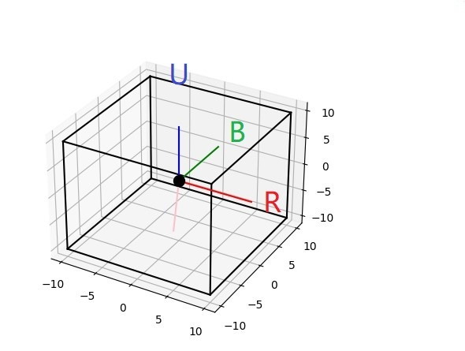

# 使用智能魔方及Python来玩原神


## 简介

[English](./README.md) | 中文


这个(玩具)项目是一个使用智能魔方(目前只支持GAN)玩原神的演示。


如果有支持BLE的电脑，你可以通过这个项目来接收智能魔方的转动和陀螺仪信息(实际上是四元数)。有了这些信息，你可以将转动和旋转映射到键盘和鼠标的按键、点击或移动，这使得你可以控制原神中的角色。

这个项目基于asyncio，主循环几乎什么都不做，只是睡觉 :)，像这样:

```python
asyncio.create_task(ask_battery())
asyncio.create_task(plt_plot())
asyncio.create_task(keyboard_handler())

gyro_en = await gyro_en_queue.get()
# 仅支持陀螺仪到鼠标映射
if gyro_en:
    print("gyro air mouse enable")
    asyncio.create_task(mouse_handler())

# 只 是 睡 觉
while True:
    await asyncio.sleep(1)

```

视频演示: [bilibili](https://www.bilibili.com/video/BV1Ku4y1f7rh), [youtube](https://www.youtube.com/watch?v=9CwsR6d1ggQ)


## 要求

- Windows 10
- Python 3.x
- bleak 
- numpy 
- matplotlib
- pynput
- PyDirectInput
- PyAutoGUI

仅仅在Windows 10上测试过，由于鼠标的DirectInput模式，我不确定它是否适用于其他操作系统，如Linux/MacOS。

`bleak`用于使计算机作为GATT客户端，可以连接到GATT服务器并通知智能魔方的特征值。

`numpy`和`matplotlib`用于对智能魔方的四元数数据进行数学计算和绘图。

鼠标输入模式将从`RawInput`更改为`DirectInput`，在某些游戏中，如原神，因此需要`PyDirectInput`和`PyAutoGUI`。但是，主要的鼠标模拟使用`pynput`。


## 用法

0. 安装所有的依赖

1. 检查你的电脑蓝牙是否打开，并确保你的电脑支持BLE。

2. 将你的魔方白色面朝上，绿色面朝前，然后通过`U U'`转动打开你的魔方。

3. 运行`main.py`脚本，它将自动搜索并连接到智能魔方。如果你有多个智能魔方，你可以通过在控制台中输入设备的索引来选择你要连接的智能魔方。

4. 玩的开心！

## 映射

目前，映射是硬编码在`keymap.py`和`main.py`中的`mouse_handler`函数中的。




| - | 映射到 |
|---|---|
|绕B轴顺时针/逆时针旋转 |鼠标x轴移动|
|绕R轴顺时针/逆时针旋转 |鼠标y轴移动|
|[L L']+ | 键盘'w'和's'和'shift'状态 |
|[U U']+ | 键盘'a'和'd'状态 |
| F' | 空格 |
| D | shift |
| D' | X |
| R | 鼠标左键单击 |
| R' + R' | 按键'e'1秒 |
| R' + R  | 按键'e' |
| F | 按键'f' |
| B + B | 按键'1' |
| B + F | 按键'2' |
| B + F' | 按键'3' |
| B' + R | 按键'4' |
| B + B' | 关闭程序 |


为什么U轴被弃用的原因是，通常使用六轴陀螺仪测量姿态，其U轴方向的偏航角是通过积分角速度获得的，这是不稳定的。